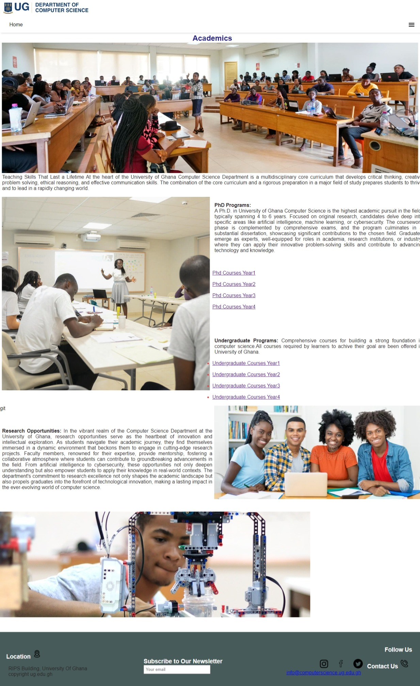
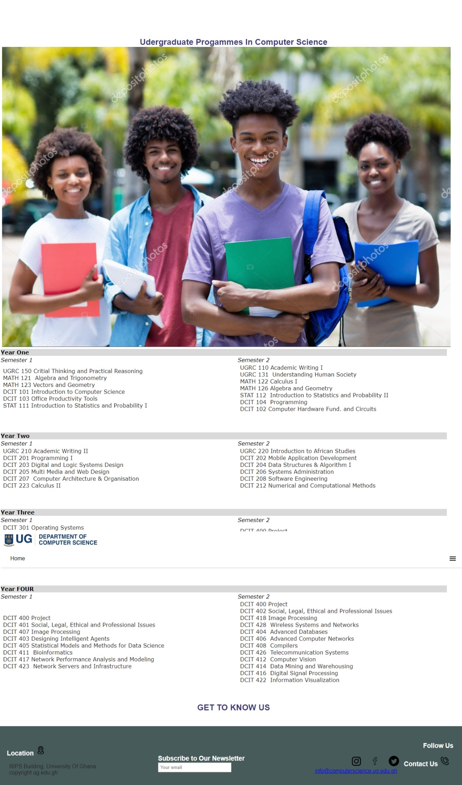
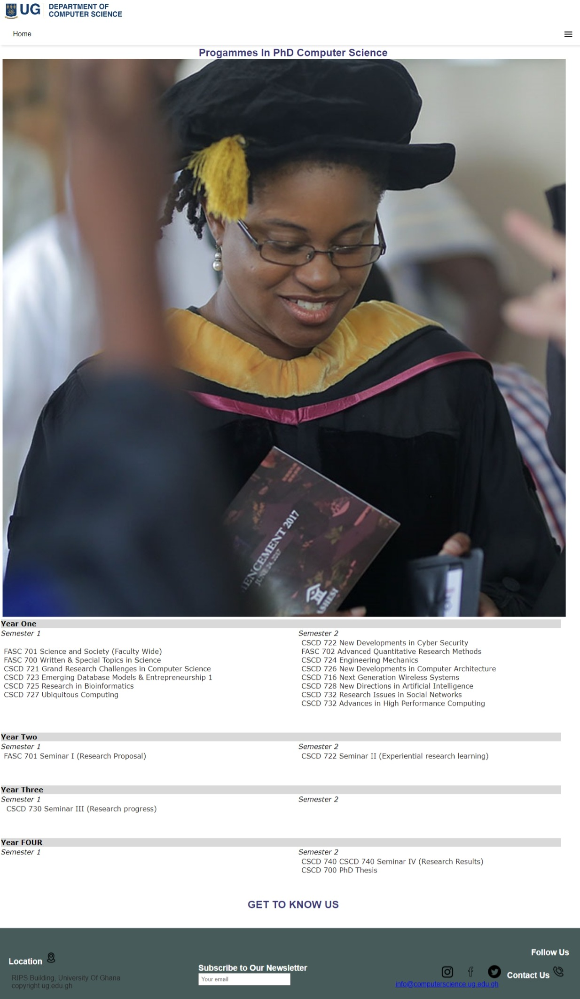
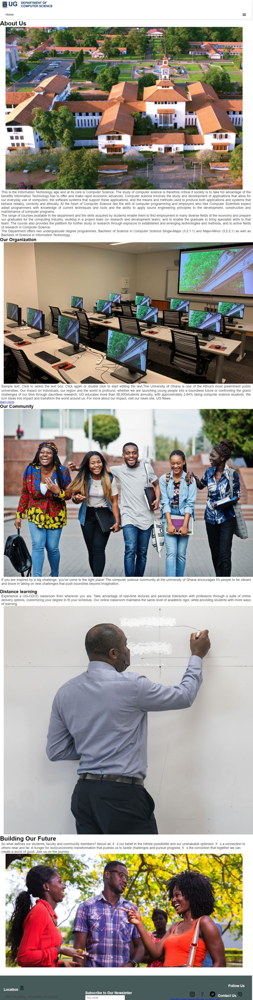

# DCIT_205_IA
## Morgan Godwin Kweku 11079266

### Introduction
This project is my version of the Computer Science department's website in line with the Interim Assessment for DCIT 205. It was made using 
* CSS
* HTML
* Javascript

It consists of the;
1. Homepage
2. Undergraduate
3. PhD
4. Compssa
5. Catalog
6. About
7. Contact Us
8. Faculty
9. Academics
10. 

### Setting Up
1. To clone and setup this project, visit the repository page and locate the code button.
2. Click on it, and select the HTTPS option.
3. Copy the url provided.
4. Open the resident terminal or git bash and enter the directory you want to work in.<br>
5. Type in 
``` bash
git clone https://kwekumorgan/11079266_DCIT_205
```


Academic page.

Undergraduate Page.

PhD Programmes

Contact Us

About

